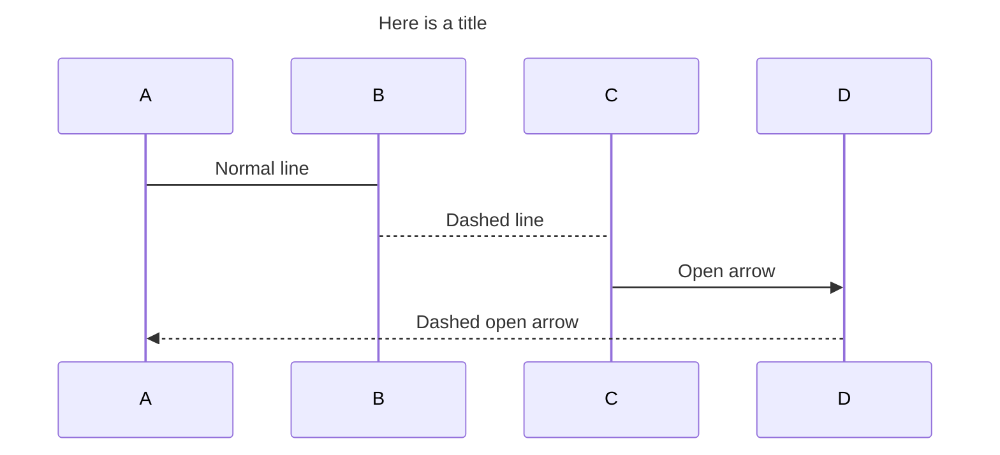
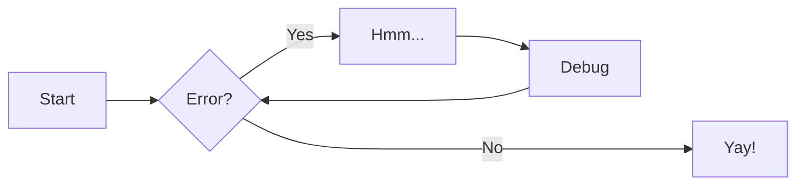

# Documentation Features

Page last revised on: {{ git_revision_date }}

```
Requirements:

mkdocs
mkdocs-material
plantuml-markdown
pymdown-extensions
pygments
mkdocs-pdf-export-plugin
fontawesome_markdown
mkdocs-git-revision-date-plugin

```

??? multiple optional-class "Summary"
    Here's some content.
    [=25%]{: .thin}

!!! note
    Lorem ipsum dolor sit amet, consectetur adipiscing elit. Nulla et euismod
    nulla. Curabitur feugiat, tortor non consequat finibus, justo purus auctor
    massa, nec semper lorem quam in massa.


:smile: :heart: :thumbsup:

## Mermaid Charts


 

## Sequence Diagrams


## Flowchart

